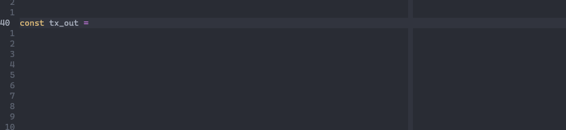

# helios-language-server

[](https://python.org/pypi/helios-language-server)
[](https://python.org/pypi/helios-language-server)

Language server for <a href="https://github.com/Hyperion-BT/Helios">Helios</a>, a non-Haskell Cardano smart contract language.
Uses the <a href="https://github.com/openlawlibrary/pygls">pygls</a> lsp framework and <a href="https://github.com/tree-sitter/tree-sitter">tree-sitter</a> for syntax tree generation.



## Requirements

* `Python >=3.7`
* `python3-pip` (Ubuntu/Debian)
* `python3-venv` (Ubuntu/Debian)

## Installation

### coc.nvim
1. Easy way via npm package <a href="https://github.com/et9797/coc-helios">coc-helios</a>:

    `:CocInstall coc-helios`

2. Alternatively, if you know how to set up Python virtual environments:

    `python3 -m venv .venv` <br>
    `source .venv/bin/activate` <br>
    `pip install helios-language-server`
    
    Put this in your `coc-settings.json` file (`:CocConfig`):
    
    ```json
    {
        "languageserver": {
          "helios": {
            "command": "helios-language-server",
            "args": ["--stdio"],
            "filetypes": ["*.hl", "hl"]
        }
    }
    ```
    The language server should now activate whenever you open `.hl` files, provided you have `filetype.nvim` plugin installed. 

### VSCode

&emsp; See <a href="https://github.com/Et9797/vscode-helios">vscode-helios</a>.

## Capabilities
- [x] Auto-completions
- [x] Hover
- [x] Signature help
- [x] Syntax errors
- [ ] Go to definition

## Comments and tips (**IMPORTANT**)
Currently only supports builtin types and methods up until **Helios v0.9.2** (apart from import statements).

While in general the tree-sitter parser works okay, there are several shortcomings as it is not always error tolerant. 
Meaning that if there are syntax errors present in the source code, the parser can sometimes generate error nodes spanning the entire document. 
This may lead to no/unexpected auto-completions. Unfortunately, not too much can be done about the parser's error recovery ability at this stage, 
as this is still also an open <a href="https://github.com/tree-sitter/tree-sitter/issues/1870#issuecomment-1248659929">issue</a> with tree-sitter. 
I have tried to address some commonly occuring parsing errors.

## To-dos
- Parser improvements
- Advanced diagnostics
- Semantic highlighting
- Imports
- Go to definition
- Support newer Helios versions
- Tree-sitter syntax highlighting (nvim)
- Type checking
